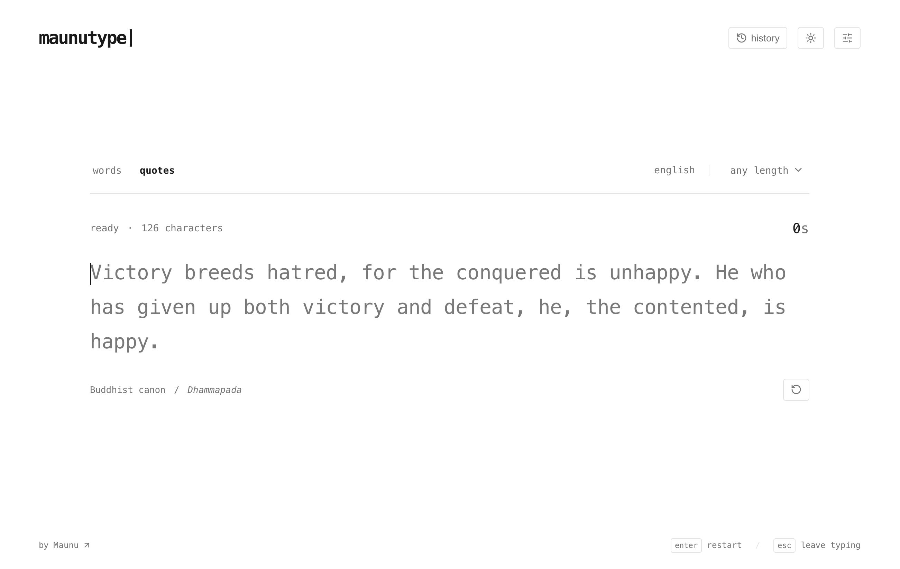

# MaunuType

The 2026 version of MaunuType: a simple typing test with a white-and-black interface, timed words, and a small collection of quotes to type.



The original application from 2023 can be found at [maunutype-2023](https://github.com/maunugit/maunutype-2023).

## Run locally

Requires Node.js 22.13 or newer.

```sh
npm install
npm run dev
```

Open the local address printed by the server (normally http://127.0.0.1:3000).

```sh
npm test
npm run typecheck
npm run lint
npm run build
```

The project uses React, TypeScript, Vite, and the scaffold's accessible Base UI/Shadcn primitives. `npm run build` produces static files in `dist/`, with relative asset URLs so the app can live under a website subpath. No runtime API or database is needed by the application. GitHub Pages integration is intentionally left for a later iteration. `npm start` serves the production build locally.

## First iteration

- 15-, 30-, and 60-second word tests in English and Finnish.
- 26 curated passages from Thoreau, Emerson, McCarthy, Epictetus, and the Dhammapada, filterable by length.
- Immediate start on the first character, inline feedback, a moving caret, and automatic line following.
- WPM and accuracy first, with a cumulative speed chart and error markers.
- Another test, same-text retry, and expandable character/error details.
- The last 100 results, all-time personal bests, and preferences stored in this browser.
- White and black default theme, a dark theme, and support for reduced-motion preferences.

### Keyboard behavior

- Type to start.
- Space advances to the next word. An empty leading space is ignored.
- Backspace removes a character. At the start of a word, it returns to the previous word.
- Option/Ctrl/Command + Backspace removes the current word (or returns to and removes the previous word when empty).
- Enter in the typing input immediately starts a fresh test, before or during typing. Tab and Shift+Tab navigate controls.
- Escape leaves the typing input and focuses restart.
- Results receive focus without activating a button. Enter begins a fresh run; Space is ignored so leftover typing cannot dismiss results. Tab navigates result controls, which can be activated with Enter.
- Pasting and dropping text into the test are disabled.
- The timer continues while the typing input or browser tab is unfocused. There is no pause advantage.

### Scoring contract (v1)

**WPM** = correct characters currently retained / 5 / elapsed minutes.

Correct characters include committed spaces and a correct partial word at timeout. Removed characters no longer contribute. Errors do not subtract an additional arbitrary WPM penalty.

**Accuracy** = correct character-entry attempts / all character-entry attempts × 100.

Wrong attempts remain in the denominator after deletion. Backspace itself is not a character attempt. Pressing Space before reaching the end of a word counts as one incorrect attempt; the omitted letters are separately reported as skipped. The resulting word separator is a retained correct space. Repeated spaces at an empty word are ignored.

**Corrections** count removed incorrect characters, including extra characters. They do not claim that every deletion was a successfully corrected mistake.

**Quotes** finish upon entering the final character position; they permit errors. A quote's duration is elapsed time rather than a countdown. Straight apostrophes and normalized whitespace avoid typographic keyboard obstacles. Punctuation and capitalization otherwise matter.

**Timing** uses `performance.now()`. Timed results clamp to the exact deadline, reject later keystrokes, and include the final partial word. The graph samples cumulative WPM approximately once a second and at completion; its crosses indicate intervals containing wrong attempts, not a second speed series.

**Personal bests** are keyed by scoring version, mode, language and duration for word tests, or exact passage ID for quotes. Repeat attempts have a separate category. Quote repeats remain recognized after older runs fall out of the recent-history list. The first completed attempt is a baseline, not a comparison against an invented record.

### Storage

All application records stay in `localStorage` under the `maunutype:` prefix. The history is limited to 100 results, while personal bests are retained separately. Malformed storage is ignored. When writing is unavailable, the application continues in memory and shows a notice. Clearing browser data removes saved results; there is no account or cross-device synchronization.

### Text sources

The initial collection is deliberately small and reviewed, rather than generated:

- Henry David Thoreau, _Walden_ (1854), original English. [Source edition](https://www.gutenberg.org/ebooks/205).
- Ralph Waldo Emerson, _Essays_ (1841–1844), original English. [Source edition](https://www.gutenberg.org/ebooks/16643).

- Buddhist canon, _Dhammapada_, F. Max Müller translation (1881). [Source edition](https://www.gutenberg.org/ebooks/2017).
- Epictetus, _The Enchiridion_, Thomas Wentworth Higginson translation. [Source edition](https://www.gutenberg.org/ebooks/45109).
- Cormac McCarthy, _The Road_ (2006), brief quotation. [Source excerpt](https://www.readinggroupguides.com/reviews/the-road/excerpt).
- Cormac McCarthy, _No Country for Old Men_ (2005), brief quotation. [Quotation source](https://wist.info/mccarthy-cormac/67657/).

Passage records include author, work, section, source URL, language/edition information, and reuse provenance. Thoreau and Emerson use public-domain originals; the Buddhist and Stoic passages use named public-domain translations. The two McCarthy entries are brief copyrighted quotations, not public-domain texts. Apostrophes and whitespace are normalized; editorial footnote markers are omitted. Every result links to its source. Word lists are curated small general-vocabulary collections, not frequency-ranked corpora.

## Structure

- `lib/typing.ts` — framework-independent scoring, timing, editing, and sampling.
- `lib/content.ts` — word lists, sourced passages, and test selection.
- `lib/storage.ts` — validated local preferences, history, and records.
- `components/typing-surface.tsx` — input handling, letter feedback, and caret placement.
- `components/speed-chart.tsx` — responsive SVG speed graph.
- `app/main.tsx` — browser entry point.
- `app/page.tsx` — test lifecycle, results, settings, and history.
- `app/globals.css` — visual language, themes, responsive layout, and motion.
- `tests/typing.test.mjs` — scoring and timer regression tests.

The scaffold's `components/ui` catalog remains unchanged and is excluded from application linting; application TypeScript still checks its imported components. `.openai/hosting.json` contains only scaffold/static-output metadata: no registered project or deployed site.

A feature-detected, read-only WebMCP tool, `read_typing_results`, can expose the latest ten result summaries to a supporting browser agent. It cannot type, start tests, or change results. This optional integration has not been exercised in a WebMCP browser context.

## Next feedback pass

The first manual pass should concentrate on caret feel and line transitions on the MacBook and Keychron keyboards, followed by result density and typography. Browser interaction QA, mobile keyboard composition, and assistive-technology testing remain manual validation items. Unit tests verify the scoring contract; they do not establish the subjective typing feel.
